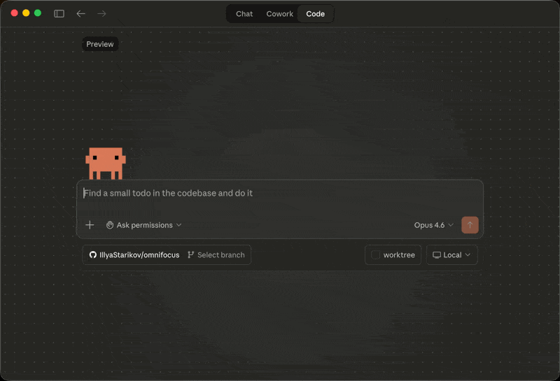

# OmniFocus MCP

[](https://www.npmjs.com/package/omnifocus-mcp-server)
[](https://opensource.org/licenses/MIT)

> ✔️ Turn prompts into projects.

Feature-complete [Model Context Protocol](https://modelcontextprotocol.io/) server for [OmniFocus](https://www.omnigroup.com/omnifocus). Full read/write access to tasks, projects, folders, tags, and perspectives — 50 tools, 2 resources, and 3 prompts.

Uses [Omni Automation](https://omni-automation.com/) (OmniJS) under the hood, executing scripts via JXA and `osascript`. This is why macOS is required.



## Table of Contents

- [Examples](#examples)
- [Install](#install)
- [Requirements](#requirements)
- [Security](#security)
- [Tools](#tools)
- [Resources](#resources)
- [Prompts](#prompts)
- [Troubleshooting](#troubleshooting)
- [Development](#development)
- [License](#license)

## Examples

> "Create a project called 'Q3 Launch' in my Work folder with subtasks for design review, copy writing, and QA — all due next Friday, assigned sequentially."

> "What's overdue? Flag anything due this week that isn't flagged yet."

> "Move all tasks tagged 'waiting' in the 'Website Redesign' project to a new 'Blocked' project."

> "Run my weekly review — go through stale projects, process inbox, and summarize what needs attention."

> "How many tasks do I have tagged 'errand'? List the ones that are available."

## Install

### Claude Desktop

Add to `~/Library/Application Support/Claude/claude_desktop_config.json`:

```json
{
  "mcpServers": {
    "omnifocus": {
      "command": "npx",
      "args": ["-y", "omnifocus-mcp-server"]
    }
  }
}
```

### Claude Code

```bash
claude mcp add omnifocus -- npx -y omnifocus-mcp-server
```

Or add to `.claude/settings.json`:

```json
{
  "mcpServers": {
    "omnifocus": {
      "command": "npx",
      "args": ["-y", "omnifocus-mcp-server"]
    }
  }
}
```

<details>
<summary><strong>Cursor</strong></summary>

Add to `.cursor/mcp.json` in your project or `~/.cursor/mcp.json` globally:

```json
{
  "mcpServers": {
    "omnifocus": {
      "command": "npx",
      "args": ["-y", "omnifocus-mcp-server"]
    }
  }
}
```

</details>

<details>
<summary><strong>Windsurf</strong></summary>

Add to `~/.codeium/windsurf/mcp_config.json`:

```json
{
  "mcpServers": {
    "omnifocus": {
      "command": "npx",
      "args": ["-y", "omnifocus-mcp-server"]
    }
  }
}
```

</details>

<details>
<summary><strong>Codex CLI</strong></summary>

Add to `~/.codex/config.toml`:

```toml
[mcp_servers.omnifocus]
command = "npx"
args = ["-y", "omnifocus-mcp-server"]
```

</details>

<details>
<summary><strong>Gemini CLI</strong></summary>

Add to `~/.gemini/settings.json`:

```json
{
  "mcpServers": {
    "omnifocus": {
      "command": "npx",
      "args": ["-y", "omnifocus-mcp-server"]
    }
  }
}
```

</details>

## Requirements

- macOS (OmniFocus is macOS-only)
- OmniFocus 4 (or OmniFocus 3 with Omni Automation support)
- Node.js >= 18
- Automation permission granted in System Settings > Privacy & Security > Automation

## Security

This server has **full read/write access** to your OmniFocus database. It can create, modify, and delete tasks, projects, folders, and tags. Only connect it to AI clients and models you trust.

No data leaves your machine — all communication happens locally via `osascript`.

## Tools

### Tasks (23)

| Tool | Description |
|------|-------------|
| `list_tasks` | List tasks with filters for status, flags, tags, projects, date ranges, and text search |
| `get_task` | Get task details by ID, optionally including subtask hierarchy |
| `create_task` | Create a task in inbox or a project, with tags, dates, and recurrence |
| `update_task` | Update task properties (name, note, dates, flags, recurrence) |
| `complete_task` | Mark a task as completed |
| `uncomplete_task` | Re-open a completed task |
| `drop_task` | Mark a task as dropped (cancelled) |
| `delete_task` | Permanently delete a task |
| `move_tasks` | Move tasks to a different project, parent task, or inbox |
| `duplicate_tasks` | Duplicate tasks, optionally into a different project |
| `set_task_tags` | Set, add, or remove tags on a task |
| `add_task_notification` | Add an absolute or due-relative notification |
| `remove_task_notification` | Remove a notification from a task |
| `list_task_notifications` | List all notifications on a task |
| `append_task_note` | Append text to a task's note |
| `get_inbox_tasks` | Get all inbox tasks |
| `get_flagged_tasks` | Get all available flagged tasks |
| `get_today_completed_tasks` | Get tasks completed today |
| `get_task_count` | Count tasks matching filters — use instead of `list_tasks` when you only need a number, not the full task data |
| `convert_task_to_project` | Convert a task into a project, preserving subtasks |
| `batch_create_tasks` | Create multiple tasks at once with subtask hierarchies |
| `batch_complete_tasks` | Complete multiple tasks at once |
| `batch_delete_tasks` | Delete multiple tasks at once |

### Projects (11)

| Tool | Description |
|------|-------------|
| `list_projects` | List projects with filters for status, folder, and text search |
| `get_project` | Get project details by ID or name |
| `create_project` | Create a project with folder, sequential, SAL, tags, and review options |
| `update_project` | Update project properties |
| `complete_project` | Mark a project as done |
| `drop_project` | Mark a project as dropped (cancelled) |
| `move_project` | Move a project to a different folder |
| `delete_project` | Permanently delete a project |
| `get_project_tasks` | Get all tasks in a project |
| `get_review_queue` | Get projects due for review |
| `mark_reviewed` | Mark a project as reviewed |

### Folders (5)

| Tool | Description |
|------|-------------|
| `list_folders` | List all folders |
| `get_folder` | Get folder details including child folders and projects |
| `create_folder` | Create a folder (supports nesting) |
| `update_folder` | Update folder name or status |
| `delete_folder` | Permanently delete a folder |

### Tags (5)

| Tool | Description |
|------|-------------|
| `list_tags` | List all tags |
| `get_tag` | Get tag details including child tags |
| `create_tag` | Create a tag (supports nesting and allowsNextAction) |
| `update_tag` | Update tag properties |
| `delete_tag` | Permanently delete a tag |

### Perspectives (2)

| Tool | Description |
|------|-------------|
| `list_perspectives` | List perspectives (built-in and/or custom) |
| `get_perspective_tasks` | Get tasks shown in a specific perspective |

### Database (4)

| Tool | Description |
|------|-------------|
| `get_database_summary` | Get counts of inbox items, projects, tags, folders, and task statistics |
| `search` | Search across all items (tasks, projects, folders, tags) by name or note |
| `dump_database` | Dump the entire database in a single call |
| `save_database` | Explicitly save the database to disk |

## Resources

| URI | Description |
|-----|-------------|
| `omnifocus://database/summary` | Database summary with counts |
| `omnifocus://perspectives` | List of all perspectives |

## Prompts

| Prompt | Description |
|--------|-------------|
| `weekly-review` | Walk through your GTD weekly review: check projects due for review, process leftover inbox items, reassess flagged tasks, and get a structured summary. Marks projects as reviewed when done. |
| `inbox-processing` | Process inbox items one-by-one using GTD methodology — delete non-actionable items, do anything under 2 minutes, and organize the rest into projects with tags and dates. |
| `daily-planning` | Build a prioritized plan for today based on due dates, flagged items, and what you've already completed. Surfaces overdue tasks and estimates your workload. |

## Troubleshooting

### "Not authorized" or no response from OmniFocus

Make sure Automation permissions are granted. Go to **System Settings > Privacy & Security > Automation** and ensure your terminal app (Terminal, iTerm, etc.) is allowed to control OmniFocus.

### Changes not taking effect after rebuild

If you're developing locally, multiple MCP server processes may be running (from Claude Desktop, Claude Code, etc.). Kill them all and restart:

```bash
pkill -f "omnifocus-mcp-server"
# or if running from source:
pkill -f "omnifocus/mcp/dist/index.js"
```

### Stale `npx` cache

If `npx` is running an old version, clear the cache:

```bash
npx clear-npx-cache
# then re-run your MCP client
```

### OmniFocus 3 compatibility

OmniFocus 3 works if Omni Automation is enabled. Go to **OmniFocus > Preferences > General** and check "Omni Automation". Some features (like certain perspective types) may behave differently.

### Tool calls are slow

Each tool call runs an `osascript` process to communicate with OmniFocus. This typically takes 200-500ms per call. Batch tools (`batch_create_tasks`, `batch_complete_tasks`, `batch_delete_tasks`) are much faster for bulk operations than calling individual tools in a loop.

## Development

```bash
npm install
npm run build      # Compile TypeScript
npm run dev        # Run with tsx (hot reload)
npm test           # Run unit tests
npm run test:watch # Watch mode
```

### Integration Tests

Tests against a real OmniFocus instance (creates and cleans up test items):

```bash
OMNIFOCUS_LIVE=1 npm run test:integration
```

### Contributing

PRs welcome. Please run `npm test` before submitting and include tests for new tools.

## License

MIT
